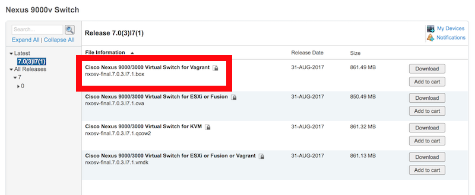
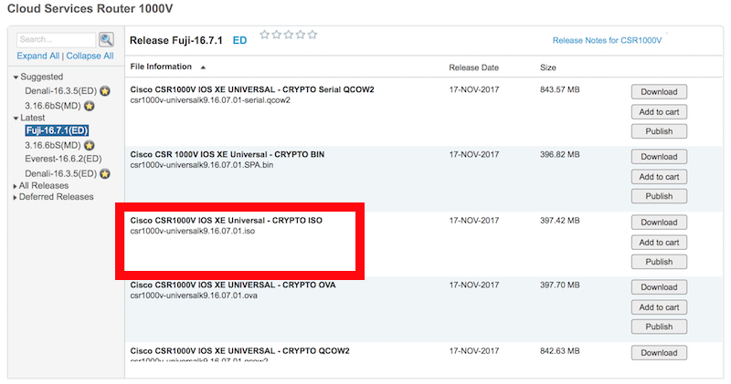

# Vagrant Box Building

Here you will find a set of utilities and scripts designed to help simplify the creation of [Vagrant Boxes](https://www.vagrantup.com/docs/boxes.html) of network devices for use with Virtual Box.  Developers can then quickly initialize and `vagrant up` an instance of a network element to build and test code and APIs.  

### Acknowledgments

Like many great Open Source projects, this project is built open the great work of others.  Specifically these scripts build on the foundation work available at [https://github.com/ios-xr/iosxrv-x64-vbox.git](https://github.com/ios-xr/iosxrv-x64-vbox.git)

## Getting Started

#### Platform Support:
These utilities are perpetually in development/beta and currently are being built and tested on MacOS.  Testing and supporting other platforms is planned, and I'd love to see contributions in this area.  

1. Clone the repo and enter the directory.  

    ```bash
    git clone https://github.com/hpreston/vagrant_net_prog
    cd vagrant_net_prog/box_building
    ```

1. Install [VirtualBox](https://www.virtualbox.org/), [Vagrant](https://www.vagrantup.com), and [socat](http://www.dest-unreach.org/socat/doc/socat.html).  There are several methods available, but one very easy way is using [Homebrew](https://brew.sh) for MacOS.  

    ```bash
    /usr/bin/ruby -e "$(curl -fsSL https://raw.githubusercontent.com/Homebrew/install/master/install)"
    brew cask install virtualbox
    brew cask install vagrant
    ```

1. Install [pexpect](https://pypi.org/project/pexpect/) for Python
    * **Note** Python 2.7 required currently

  ```bash
  pip install -r requirements.txt
  ```

1. Continue with device specific steps.

## Supported Devices

* [Cisco Nexus 9000v](#cisco-nexus-9000v) - Running the same Open NX-OS available on Nexus 9000 and 3000 platforms, the 9000v is a great platform for building and testing scripts and code for data center automation.
* [Cisco CSR 1000v](#cisco-csr-1000v) - The CSR runs IOS XE, just like Cisco's Catalyst Switches and many routing platforms (such as ISR, ASR 1K, etc), and is a great platform for experimenting with features like Model Driven Programmability, Day Zero Technologies and Application Hosting.
* [Cisco IOS XRv](#cisco-ios-xrv) - Running the same IOS XR code available on NCS and ASR 9K platforms, the XRv enables developers a resource for automating service provider networks.  

# Cisco Nexus 9000v

Cisco publishes a Vagrant Box for the Nexus 9000v on CCO for each release, however the published box provides an unconfigured switch that boots expecting initial configuration processes to continue.  Instructions for manually completing the configuration is available on [Cisco DevNet](https://developer.cisco.com/site/nx-os/docs/guides/developer-tooling/index.gsp).  

> Note: The boxes posted to CCO for Open NX-OS 7.0(3)I7(3) or later, are ready to use immediately after download and do **not** require that you run this customization script to make it ready.  In this case, you can simply add the downloaded box to your inventory immediately with a command such as `vagrant box add nxos/7.0.3.I7.3 ~/Downloads/nxosv-final.7.0.3.I7.3.box --force`.

The [`nxosv_vbox_prep.py`](nxosv_vbox_prep.py) script completes the initial configuration of the 9000v, deploys a basic configuration for management and API access, and adds the typical Vagrant user account and SSH key making it ready for usage for developers.  

## Building a Nexus 9000v Box

1. Download the source Nexus 9000v Vagrant Box from [Cisco.com](https://software.cisco.com/portal/pub/download/portal/select.html?&mdfid=286312239&softwareid=282088129).  You will need to have an account with Cisco, but no specific entitlement is requried to download the software.  

    

1. Generate the configured Vagrant Box (VirtualBox) by calling the script and pointing it to the downloaded source box you downloaded.  The script will provide feedback of each step and provide feedback for how to complete at the end.  

    ```bash
    python nxosv_vbox_prep.py ~/Downloads/nxosv-final.7.0.3.I6.1.box

    ==> Check whether "socat" is installed
    ==>   Note: An error may occur if the Vagrant environment isn't initialized, not problem
    ==> Creating Vagrantfile
    ==> Starting Vagrant Environment.
    ==>   Note: vagrant may generate an error, that is expected
    ==> Found VirtualBox VM: box_building_default_1504808984602_7700
    ==> Waiting for NX-OS to boot (may take 3 minutes or so)
    ==> Logging into Vagrant Virtualbox and configuring NX-OS
    ==> Aborting POAP
    ==> Disable Secure Password
    ==> Setting Admin Password
    ==> Confirming Admin Password
    ==> Disable Basic Sys Config
    ==> Logging in as admin
    ==> Enter Enable/Config Mode
    ==> Setting boot image
    ==> Finishing Config and Saving to Startup-Config
    ==> Waiting 10 seconds...
    ==> Powering down and generating new Vagrant VirtualBox
    ==> Waiting for machine to shutdown
    ==> New Vagrant Box Created: box_building/created_boxes/nxos_7.0.3.I6.1/nxos_7.0.3.I6.1.box
    ==> Completed!
    ==>
    ==> Add box to system:
    ==>   vagrant box add --name nxos/7.0.3.I6.1 box_building/created_boxes/nxos_7.0.3.I6.1/nxos_7.0.3.I6.1.box --force
    ==> Initialize environment:
    ==>   vagrant init nxos/7.0.3.I6.1
    ==> Bring up box:
    ==>   vagrant up
    ==> Note:
    ==>   Both the NX-OS SSH and NX-API username and password is vagrant/vagrant
    ```

1. Add the newly created box to your local Vagrant inventory.  ***The script ends with the exact command to use based on your machine, but here is an example for reference.***

    ```bash    
    vagrant box add --name type/version path_to_box.box --force
    ```

# Cisco CSR 1000v

Cisco does not publish a Vagrant box for the CSR 1000v, but as a virtual IOS XE platform, you can create a create a Vagrant box from the published ISO disk image available on CCO.  The instructions and scripts compiled in this repository pull heavily from resources available in [https://github.com/ios-xr/iosxrv-x64-vbox.git](https://github.com/ios-xr/iosxrv-x64-vbox.git)

The [`iosxe_iso2vbox.py`](iosxe_iso2vbox.py) script automates the creation of a Vagrant Box from the ISO image including a basic configuration for management and API access, and adds the typical Vagrant user account and SSH key making it ready for usage for developers.

## Building a CSR 1000v Box

1. Download the source CSR 1000v ISO image from [Cisco.com](https://software.cisco.com/download/release.html?mdfid=284364978&softwareid=282046477).  To download the ISO image, you will need a CCO account with adequate entitlements assigned.  
    * Be sure to download the **ISO** version of the posted file.  
    * The script has been tested with code versions 16.5+
    * *If there are multiple ISO images posted, and one includes `serial` in the title, download that one.*

    

1. If you downloaded version 16.6 or 16.7, the ISO defaults to booting to a VGA input.  For automated script processing to create images, the VM needs to boot to a **Serial** input.  To change the default boot mode run the [`csr_iso_modify.sh`](csr_iso_modify.sh) (Linux) or [`csr_iso_modify_mac.sh`](csr_iso_modify_mac.sh) (Mac OS X).  This script will create a new `.iso` image prefixed with `serial-` that can be used in the following step.  
    * *Version 16.5 and 16.3 ISO defaulted to a Serial input already.*
    * To run the script on Mac OS X, you'll need to install the Linux utility `mkisofs`.  You can do this with [Homebrew](http://brew.sh) with: `brew install cdrtools`.  

    ```bash
    ./csr_iso_modify_mac.sh ~/Downloads/csr1000v-universalk9.16.07.01.iso

    /var/folders/dh/t0frtgx514388l6ycj2bl7740000gn/T/tmp.qPqNs0TJ ~/coding/vagrant_net_prog/box_building
    /dev/disk4          	                               	/Volumes/CDROM
    Using CSR10000.PKG;1 for  /csr1000v-rpboot.16.07.01.SPA.pkg (csr1000v-mono-universalk9.16.07.01.SPA.pkg)
    Size of boot image is 4 sectors -> No emulation
      2.46% done, estimate finish Fri Dec  8 13:26:42 2017
      4.92% done, estimate finish Fri Dec  8 13:26:42 2017
      7.38% done, estimate finish Fri Dec  8 13:26:42 2017
      .
      .
     95.85% done, estimate finish Fri Dec  8 13:26:44 2017
     98.30% done, estimate finish Fri Dec  8 13:26:44 2017
    Total translation table size: 2048
    Total rockridge attributes bytes: 1347
    Total directory bytes: 4096
    Path table size(bytes): 34
    Max brk space used 0
    203477 extents written (397 MB)    
    ```

1. Generate a Vagrant Box (VirtualBox) by calling the script and pointing it to the ISO image (likely the `serial-csr1000v-{version}.iso` you just created).  The script will provide feedback of each step and provide feedback for how to complete at the end.

    ```bash
    python iosxe_iso2vbox.py serial-csr1000v-universalk9.16.07.01.iso
    ==> Check whether "socat" is installed
    ==> Input ISO is serial-csr1000v-universalk9.16.07.01.iso
    ==> Creating VirtualBox VM
    ==> Starting VM...
    ==> Failed to install VM disk image

    ==> Successfully started to boot VM disk image
    ==> Waiting for IOS XE to boot (may take 3 minutes or so)
    ==> Logging into Vagrant Virtualbox and configuring IOS XE
    ==> Waiting 10 seconds...
    ==> Powering down and generating Vagrant VirtualBox
    ==> Waiting for machine to shutdown
    ==> Compact VDI
    ==> Building Vagrant box
    ==> Created: /Users/hapresto/coding/vagrant_net_prog/box_building/created_boxes/serial-csr1000v-universalk9.16.07.01/serial-csr1000v-universalk9.16.07.01.box
    ==> Add box to system:
    ==>   vagrant box add --name iosxe/16.07.01 /Users/hapresto/coding/vagrant_net_prog/box_building/created_boxes/serial-csr1000v-universalk9.16.07.01/serial-csr1000v-universalk9.16.07.01.box --force
    ==> Initialize environment:
    ==>   vagrant init iosxe/16.07.01
    ==> Bring up box:
    ==>   vagrant up
    ==> Note:
    ==>   Both the XE SSH and NETCONF/RESTCONF username and password is vagrant/vagrant
    ```

1. Add the newly created box to your local Vagrant inventory. **The script ends with the exact command to use based on your machine, but here is an example for reference.**

    ```bash
    vagrant box add --name type/version path_to_box.box --force
    ```

# Cisco IOS XRv 
The IOS XR BU has an ongoing public beta for folks interested in the IOS XR with Vagrant.  The steps to participate are: 

1. Request access to the beta at [this site](https://xrdocs.github.io/getting-started/iosxr-vagrant-beta).
1. Generate an API-KEY to download the box with [these instructions](https://xrdocs.github.io/getting-started/steps-download-iosxr-vagrant).    
1. Follow the quickstart guide [here](https://xrdocs.github.io/application-hosting/tutorials/iosxr-vagrant-quickstart).  

# Using Your New Box!

With your new box created, you can now get started using it in your own projects.  

1. Create a directory as the base for your project.  This directory will store your Vagrantfile (the configuration of your local development instance) as well as any code, notes, playbooks, etc you build.  
    * Note: Vagrant only supports a single environment definition or `Vagrantfile` in a directory.  

  ```bash
  mkdir my_project
  cd my_project
  ```

1. Initialize a new Vagrantfile using the new box.  ***Each build  script ends with the exact command to use based on your machine, but here is an example for reference.***

    ```bash
    vagrant init type/version
    ```

1. Start your environment.

    ```bash
    vagrant up
    ```

    * **Note: `vagrant up` for the Nexus 9000v will likely end with an error similar to the below.  This is expected and we are working on resolving the error.  Simply run `vagrant up` again until you get the success message.**

        ```bash
        The configured shell (config.ssh.shell) is invalid and unable
        to properly execute commands. The most common cause for this is
        using a shell that is unavailable on the system. Please verify
        you're using the full path to the shell and that the shell is
        executable by the SSH user.        
        ```     

1. Log into your environment.

    ```bash
    $ vagrant ssh

    ***************************************************************************
    *  Nexus 9000v is strictly limited to use for evaluation, demonstration   *
    *  and NX-OS education. Any use or disclosure, in whole or in part of     *
    *  the Nexus 9000v Software or Documentation to any third party for any   *
    *  purposes is expressly prohibited except as otherwise authorized by     *
    *  Cisco in writing.                                                      *
    ***************************************************************************
    n9kv1#    
    ```
